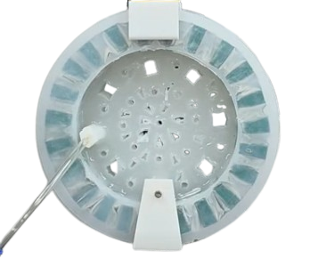
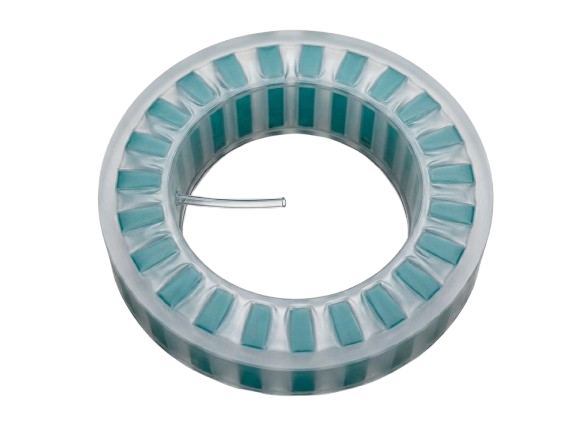

# Pneumatic Morphing Wheel

Design exploration of a pneumatically actuated morphing wheel developed during work with the **Soft Robotics Laboratory at Sungkyunkwan University (SKKU)**.

<p align="center">
  
  
</p>

The project investigates how a wheel can transition between a **compliant state** for adapting to uneven terrain and a **stiffer state** for stable rolling. The design work focuses on controlled deformation, structural support, shape recovery, torque transmission, and pneumatic integration.

## Technical report

**[Read the full design report (PDF)](report/Pneumatic_Morphing_Wheel_Design_Exploration.pdf)**

The report is the main narrative for this repository. It preserves the original project visuals and design-development process while presenting the work in a cleaner technical-report format.

The editable LaTeX source is also included in [`report/`](report/), so the report can be opened and recompiled in Overleaf.

## Project focus

The prototype demonstrated the basic morphing concept while revealing several practical design challenges:

- labor-intensive assembly of soft pneumatic components;
- deformation that could become difficult to control or reproduce;
- excessive compliance and lateral instability under load;
- difficulty creating a rigid motor/drive interface around a soft central structure; and
- the need to deliver both rotational torque and pneumatic airflow to a rotating wheel.

The design exploration therefore considers:

- **guided deformation** through predefined compliant regions or grooves;
- **spring-assisted structural support** for shape recovery and distributed load support;
- **deformation limiters** to prevent excessive collapse;
- an **external chain drive** for torque transmission; and
- a **rotary pneumatic joint** for continuous airflow through the rotating hub.

## Repository structure

```text
pneumatic-morphing-wheel/
├── README.md
├── LICENSE_NOTICE.md
├── THIRD_PARTY_ASSETS.md
├── report/
│   ├── main.tex
│   ├── README_OVERLEAF.md
│   ├── Pneumatic_Morphing_Wheel_Design_Exploration.pdf
│   └── figures/
└── design/
    └── cad/
        ├── big_contraction_fixture_1.stl
        ├── big_contraction_fixture_2.stl
        ├── big_extension_fixture_1.stl
        ├── big_extension_fixture_2.stl
        ├── small_contraction_fixture_1.stl
        ├── small_contraction_fixture_2.stl
        ├── small_extension_fixture_1.stl
        └── small_extension_fixture_2.stl
```

## CAD files

The STL files in [`design/cad/`](design/cad/) are paired support/fixture components used to hold the wheel for contraction and extension testing. They are included as supporting project artifacts rather than as the central result of the repository.

## Experimental data

Preliminary testing was conducted during development, but the available measurements were exploratory and are not used here to make quantitative stiffness or performance claims. For that reason, the raw spreadsheets are intentionally **not included in this public-facing repository**. The report instead treats controlled mechanical characterization as future validation work.

## Tools and methods

Mechanical prototyping · pneumatic actuation · soft/compliant structures · CAD · physical testing · design iteration · system integration

## Notes on attribution and reuse

Some report figures reference externally sourced material. See [`THIRD_PARTY_ASSETS.md`](THIRD_PARTY_ASSETS.md) and the citations in the report before publishing or redistributing those assets. Laboratory-generated CAD, photographs, and design material should only be made public if sharing is permitted.
